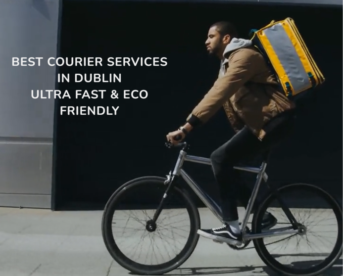

# Bike Express

## Welcome to the site of the best courier services in Dublin 

Bike Express site helps to connect best bike courier in Dublin with a people looking for a fast parcel delivery at the best pricing. This site will advertise and promote eco friendly way of delivering goods without compromising quality of services. Site will be useful to Dublin companies and individuals looking to find better ways to deliver their parcel within same day or same hour.

## Features

Bike Express site have a number of features to help demonstrate a uniqueness of services provided, provides a quick contact detail and possibility to obtain a quote for the required services.
 
#### 1. Navigation Bar    
  * Navigation Bar provides links to the all sections on the main page - About Us, Our Services, Contact as well as Gallery page and Get a Quotation page.
  * Navigation Bar remains the same across all the pages to allow easy navigation.
  * For mobile devices navigation bar is replaced with hamburger menu to enhance user experience.
  
  
 

#### 2. The landing page video
  * This section introduce user to Bike Express with a video of courier cycling with delivery.
  * Text overlay emphasize that user has landed on the page of the fast and most eco friendly courier company in Dublin.
   

#### 3. About Us section 
  * User will get familiar with the Bike Express values, mission and who creates a team in this section, allowing for better understanding of differential factor.
  * Section will help user to see a bigger picture and greater goal of the company helping to make a better choice.
  

#### 4. Our Services 
  * This section will give an outlook one services offered and why Bike Express offer is better that its competitors.
  * User will see a set of  quality services what should encourage to pick the company for the next delivery.
  

#### 5. Contact Us
  * User will find here all the necessary informations to get in touch with Bike Express.
  * Map will allow easy location of depot and offices,
  

#### 6. Footer
  * Footer contains social media links to encourage user to stay in touch and follow the company
  * This sections remains the same across whole site and links open in the new tab
  

#### 7. Gallery 
  * This page will demonstrate day to day work of Bike Express courier, allowing better understanding how the services works.
  * User will be able to identify dedicated, hardworking team what will build a confidence of quality services provide by the company.
  *

#### 8. Get a Quote 
  * This section will allow customer to send a quote for the services required by filling all the personal details as well as delivery destination and preferred type of services.
  
  

## Testing 
  Extensive testing was employed to ensure responsiveness of Bike Express site across all the devices. During that process a number of minor bug was eliminated like:
   * Disappearing  social icons in mobile view caused by missing class on ul element. 
   * Contact details font overflowing in mobile view caused by incorrect font size 
  
### Validator Testing 
  1. HTML - minor errors returned and fixed, iframe error ignored due to official copy/past syntax from maps.google.com. All the rest passed though the official [W3C validator](https://validator.w3.org/nu/?doc=https%3A%2F%2Fmr-pete.github.io%2Fbike-express%2F)
  2. CSS - minor errors returned and fixed. All passed through [Jigsaw validator](https://jigsaw.w3.org/css-validator/validator?uri=https%3A%2F%2Fmr-pete.github.io%2Fbike-express%2F&profile=css3svg&usermedium=all&warning=1&vextwarning=&lang=en)

## Deployment
  Bike Express page was deployed to GitHub pages by the standard steps including:
    * Navigation to settings in the GitHub repository and Pages section
    * Selection of Main Branch from drop-down source menu.
 The live link to the website - https://mr-pete.github.io/bike-express/index.html
 
 ## Credits
 
 ### Content
  * The text inspirations for the home page were taken from [City Sprint UK](https://www.citysprint.co.uk/about-us/csr/green)
  * The instruction on how to build a hamburger menu with html and css was taken from [YouTube Tutorial](https://youtu.be/oLgtucwjVII)
  * The icons for the Contac section and footer were taken from [Font Awesome](https://fontawesome.com/)
 
 ### Media
  * The video and photo used on the website as well as photos used in the gallery were sourced from [Pexels](https://www.pexels.com/pl-pl/@mart-production)
  * Images were optmized and compressed with use of thie free [online tool](https://www.iloveimg.com/)
  * To cut video lenght tool [Online Video Cutter](https://online-video-cutter.com/pl/) was used

    
